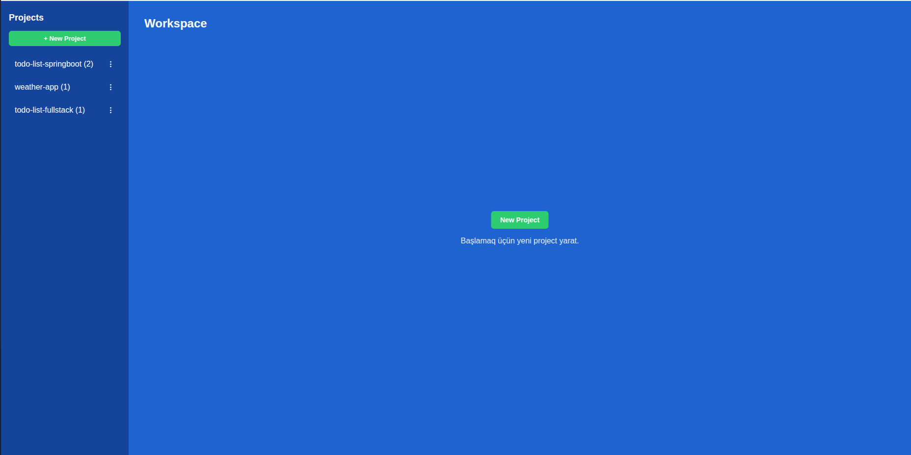
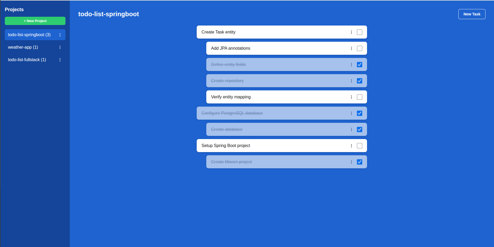

# To-Do List Web Application

A simple To-Do List web application. Users can create projects, add tasks (with an optional description) inside each project, break tasks down into subtasks, mark items as completed, and delete them.

## Features

- Create a **project** (green "New Project" button)
- Projects appear in the **sidebar** on the left
- Clicking a project in the sidebar opens its workspace
- Add a new **task** inside a project (blue "New Task" button); a task has a **title** and an optional **description**
- Tasks are shown as white cards with a **checkbox** on the right (completed marker); the description appears below the title in smaller gray text
- Add **subtasks** to a task via its **⋮** menu ("Add Subtask"); a subtask also has a title and an optional description
- Subtasks are shown indented beneath their parent task, as white cards with their own checkbox and **⋮** menu
- **Edit** projects (rename) and tasks/subtasks (change title and description) from the **⋮** menu
- Delete projects, tasks, and subtasks from the **⋮** menu (with a confirmation prompt); deleting a task also deletes its subtasks
- Each project in the sidebar shows its task count, e.g. `Build UI (3)`
- Completed tasks are shown with a strikethrough title and a faded card
- **Validation:** project names and task titles cannot be empty; the server returns `400` for invalid input and `404` for a missing id, and the UI shows a simple error message

## Screenshots




## Technologies

- **Backend:** Java 17, Spring Boot (Spring Web, Spring Data JPA), Maven
- **Database:** PostgreSQL
- **Frontend:** Plain HTML, CSS, and vanilla JavaScript (no frameworks)

## Requirements

- Java 17
- Maven 3.9+
- PostgreSQL running on port 5432

## Database setup

Create a database named `tododb` in PostgreSQL:

```sql
CREATE DATABASE tododb;
```

The tables (`project`, `task`) are created automatically on startup
(`spring.jpa.hibernate.ddl-auto=update`).

## Configuration

Database credentials are read from environment variables (nothing is hardcoded):

- `DB_USERNAME` — database user (defaults to `postgres` if not set)
- `DB_PASSWORD` — database password

## Build and run

From the project root, provide the credentials via environment variables and start the app:

```bash
export DB_USERNAME=postgres
export DB_PASSWORD=your_password
mvn spring-boot:run
```

Alternatively, build a JAR and run it:

```bash
mvn clean package
export DB_USERNAME=postgres
export DB_PASSWORD=your_password
java -jar target/todo-1.0.0.jar
```

Once the app is running, open it in your browser:

```
http://localhost:8080
```

## REST API

### Project

| Method | Endpoint             | Description       |
|--------|----------------------|-------------------|
| GET    | `/api/projects`      | List all projects (with task counts) |
| POST   | `/api/projects`      | Create a project  |
| PUT    | `/api/projects/{id}` | Update a project's name |
| DELETE | `/api/projects/{id}` | Delete a project  |

### Task

| Method | Endpoint                          | Description                            |
|--------|-----------------------------------|----------------------------------------|
| GET    | `/api/projects/{projectId}/tasks` | List a project's top-level tasks       |
| POST   | `/api/projects/{projectId}/tasks` | Create a task                          |
| POST   | `/api/tasks/{parentId}/subtasks`  | Create a subtask under a task          |
| PUT    | `/api/tasks/{id}`                 | Update a task's title and description  |
| PUT    | `/api/tasks/{id}/toggle`          | Toggle a task's completed status       |
| DELETE | `/api/tasks/{id}`                 | Delete a task (and its subtasks)       |

## Project structure

```
src/main/java/com/example/todo/
├── TodoApplication.java      # Entry point
├── Project.java              # Project entity
├── Task.java                 # Task entity (self-referencing parent for subtasks)
├── ProjectRepository.java
├── TaskRepository.java
├── ProjectController.java    # Project REST API
└── TaskController.java       # Task REST API

src/main/resources/
├── application.properties    # PostgreSQL configuration (env-based credentials)
└── static/
    ├── index.html
    ├── style.css
    └── app.js
```
